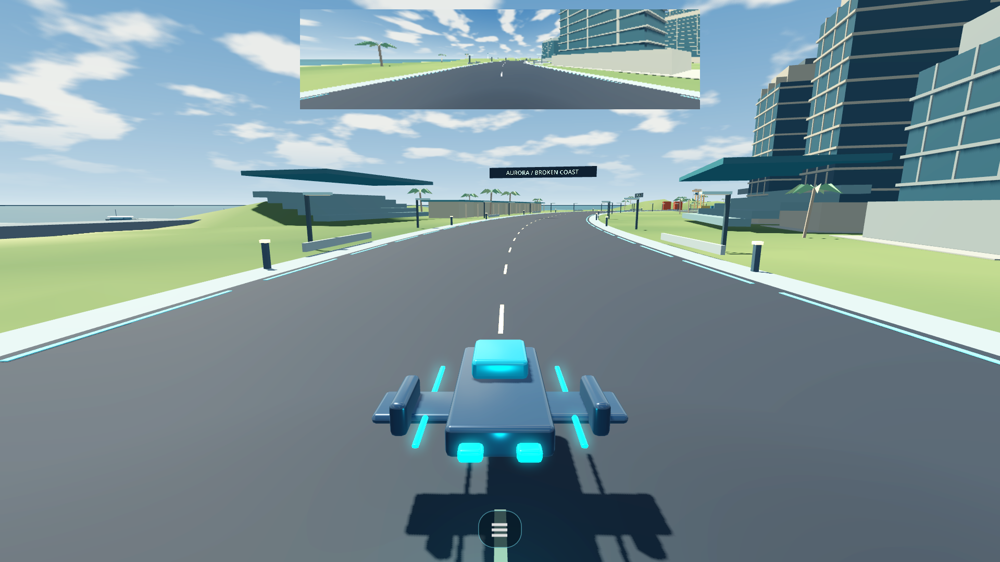
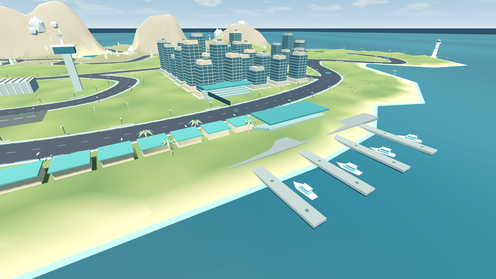
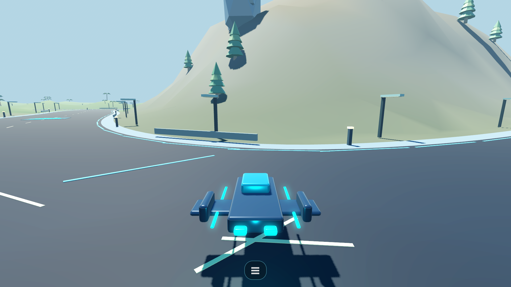
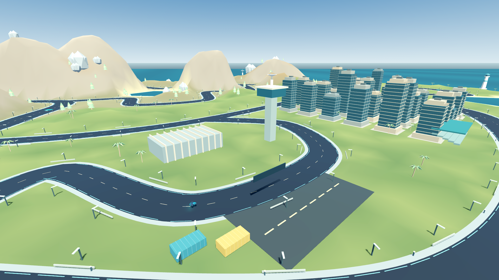
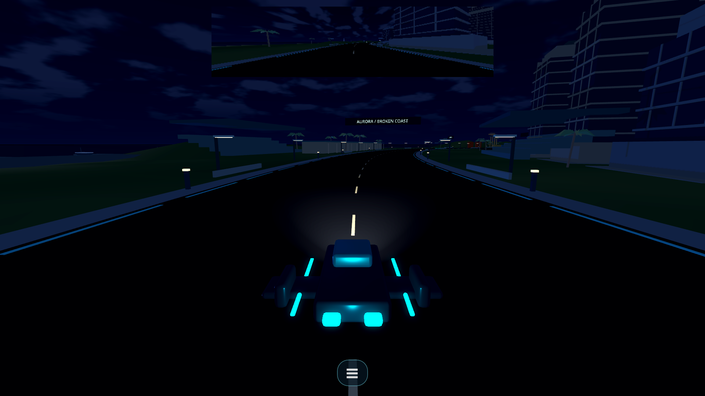
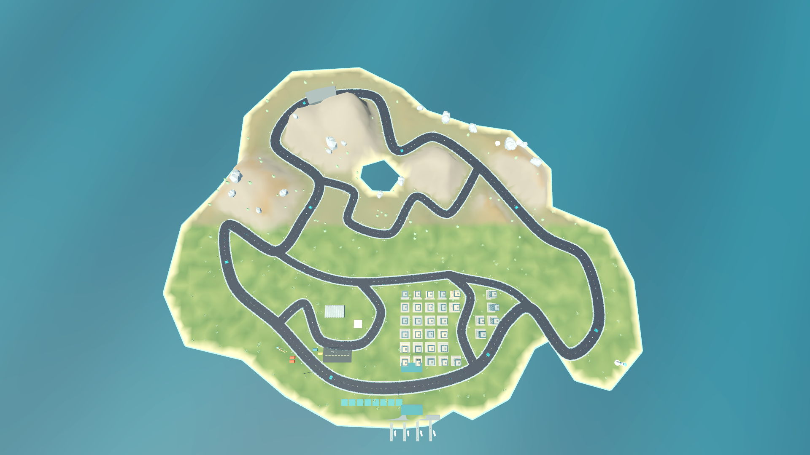

# Neon Pursuit: Aurora Bay

**Current build:** Neon Pursuit **v0.6.3**\
**Map:** Aurora Bay **5.0**  
**Branch:** `main`  
**Targets:** Android, Windows, Linux  
**CI:** Godot 4.7.2 regression suite gates release builds

An open-map arcade pursuit racer for Android and PC. Cruise a connected coastal world, jump into an event instantly, and swap craft or modes without leaving the drive. The current playtest build includes seven event types, four districts, three ships, AI rivals, police pursuits, persistent medals and instant retries.

## Aurora Bay

The map connects 8.44 km of roads through the coast, harbor, canyon and airfield. The main route is 5.09 km, with an irregular shoreline, inland reservoir, ridge tunnel, city blocks, piers and a container yard. Roads and driving physics stay level; the mountains add terrain relief rather than jump physics.

### Aurora Bay 5.0

Six new **1920 × 1080 screenshots captured from the running Godot game**, with runtime world geometry, lighting and UI. The coastal drive, harbor piers, canyon road, airfield, nighttime drive and overhead map use authored landmark views, road-aligned ship headings and fixed times of day.

**Coast — daytime driving**



**Harbor — piers and waterfront**



**Canyon — daytime driving**



**Airfield — hangar and control tower**



**Coast — nighttime headlights and streetlights**



**Aurora Bay — overhead world view**



## Driving and events

- **Free Roam** for uninterrupted exploration.
- **Bay Sprint** and **Coast Circuit** against AI rivals.
- **Checkpoint Rush** with time added at each gate.
- **Pursuit** with road-network police and search behavior.
- **Drift Rush** where slides build a combo that must be banked.
- **Elimination** and **Speed Trial** for short score-chasing runs.

Choose Coast, Harbor, Canyon or Airfield. Events have levels, medals and saved records. Retry resets straight to the action; there are no race intro sequences. The compact driving HUD stays clear of diagnostic text; use **F3** (or the bottom menu button on touch) for the event and craft menu.

Touch, keyboard, mouse, and gamepad input are supported. Android is a first-class playtest target; pushes to `main` run the regression suites before Android, Windows, and Linux build jobs are allowed to proceed. The camera follows close behind the craft. The look uses stylized 3D geometry, sky lighting, shadows, emissive road markings and reflective water. The built-in sky environment currently runs a 7-minute daylight and 4-minute night cycle. Real-time global illumination is not currently implemented.

## Settings and radio

The menu’s Settings page saves music volume, VSync, fullscreen, rearview visibility, and touch layout between sessions. F11 and the fullscreen setting stay synchronized. The borderless rearview pauses rendering while hidden. Four radio stations play original locally synthesized looping music; use the menu arrows to switch stations and set music volume to zero to mute. These are instrumental loops, not streamed broadcasts.

## Version history

The current development build is **v0.6.3**, with **Aurora Bay 5.0**. Game versions track gameplay, rendering and tooling changes; map revisions track the authored world. These are development milestones: this repository currently has **no release tags**. Earlier semantic versions below are retrospective labels, not published releases.

| Game milestone | Map | Date | Evidence and changes |
| --- | --- | --- | --- |
| **v0.6.3 — current** | **5.0** | 2026-10-01 | [Rendering fixes](https://github.com/Tricky-Nerdy/neon-pursuit-playtest/commit/85886954e053e62bfb5b4e0dabe0d976410473c1): clear fog, stable world-space water, camera depth precision, junction-safe road stripes, readable night fill and six composed in-game screenshots. Project metadata now records this version. |
| **v0.6.2 — documented playtest** | **5.0** | 2026-10-01 | [Version documentation](https://github.com/Tricky-Nerdy/neon-pursuit-playtest/commit/d2bc88d), [overhang lights](https://github.com/Tricky-Nerdy/neon-pursuit-playtest/commit/006e95e), and [six tested captures](https://github.com/Tricky-Nerdy/neon-pursuit-playtest/commit/24c38c65383229ccef387011fe16d9f5e86e0233): headlights, street fixtures, regression/build tooling and actual Godot capture support. |
| **v0.6.1 — retrospective lighting milestone** | **5.0 label used retrospectively** | 2026-10-01 | [Tunable cycle fix](https://github.com/Tricky-Nerdy/neon-pursuit-playtest/commit/8b3e433) and [vehicle headlights](https://github.com/Tricky-Nerdy/neon-pursuit-playtest/commit/8665ef8). Lighting work overlapped the scene refactor. |
| **v0.6.0 — retrospective scene milestone** | **5.0 label used retrospectively** | 2026-10-01 | [Scene structure](https://github.com/Tricky-Nerdy/neon-pursuit-playtest/commit/9b6b1e4) and [gameplay binding](https://github.com/Tricky-Nerdy/neon-pursuit-playtest/commit/69ca00d): explicit World, Vehicles, Gameplay, UI and Camera nodes, reusable ship scene and free-roam spawns. |
| **Unversioned repository baseline** | **4.0 / 4.1 in source documents** | 2026-09-28 | [Initial import](https://github.com/Tricky-Nerdy/neon-pursuit-playtest/commit/60b14fb), [controls/build pipeline](https://github.com/Tricky-Nerdy/neon-pursuit-playtest/commit/69e46c2), and [day/night environment](https://github.com/Tricky-Nerdy/neon-pursuit-playtest/commit/3b2c934). The imported README described Aurora Bay 4.0; the test report described 4.1. |

The available repository starts with an existing game import. It does not establish separate v0.4.x/v0.5.x releases or an Aurora Bay 1–3 development timeline. See [CHANGELOG.md](CHANGELOG.md) for version policy, detailed current changes and validation.

## Developers

### Requirements and launch

- Godot **4.7.2** and matching export templates for official builds.
- Open `project.godot` in Godot and press Play, or launch with `run_game_linux.sh` / `run_game_windows.cmd`.
- All runtime models are included in `assets/`. Editable Blender sources and generation scripts are in `tools/`; no extra asset packs are required.

### Tests and diagnostics

See [`tests/TEST_REPORT.md`](tests/TEST_REPORT.md) for the latest automated results and known limits. Run the suites from the project root:

```sh
godot --headless --editor --path . --import --quit
for suite in run_all input_devices ai_endurance mission_scenarios police_scenarios world_integrity; do
    godot --headless --path . --fixed-fps 60 --script "tests/$suite.gd" || exit 1
done
```

Runtime events and periodic performance samples are written to `user://neon_pursuit.log`; the game does not add a debug bar to the driving view. `tests/render_capture.gd` captures six views from the running game when launched with a graphical display. Reproduce and validate them with:

```sh
godot --headless --editor --path . --import --quit
godot --headless --path . --script tests/render_capture_test.gd
godot --headless --path . --script tests/world_rendering.gd
xvfb-run -a -s "-screen 0 1920x1080x24" godot --path . --resolution 1920x1080 --rendering-method gl_compatibility --script tests/render_capture.gd
python3 tests/verify_render_captures.py
```

The capture regression test checks scene loading, road-centered positions and headings, exact camera poses after teleporting, landmark framing and day/night lighting. `tests/world_rendering.gd` checks clear visibility and prevents road stripes crossing junctions. The world uses fog-free lighting, explicit night ambient fill and world-space water shading. Image validation rejects missing, damaged, flat or duplicate captures. CI runs capture independently of the gameplay suites and uploads all six PNGs. The images in `tests/geometry_review/` are scene geometry reviews and should not be presented as gameplay captures.

### Playtesters

Playtest setup, controls, TV connection, release downloads and update/signing notes are in the [Playtester Guide](PLAYTESTER_GUIDE.md). Windows and Linux prereleases are built from version tags. Android release builds require the persistent tester signing key described in that guide.

## Project notes

This is a playable prototype and playtest project, not a finished commercial release. Android store distribution and silent updates are not configured. No code or assets from G-Zero, EVE, WipEout or NFS are distributed.

### Editing the map

Open `scenes/main.tscn` in Godot’s 3D editor. The World now generates the same terrain, roads, and scenery in the editor, with an animated day/night cycle and four racers running the same AI and craft driving model as gameplay, so the `World/FreeRoamSpawns` markers can be positioned against the actual map without running the game. Generated geometry and editor simulation racers are transient and are not saved into the scene; edit the spawn markers normally. Reopen the scene after pulling this change.

Editor regression check: `godot --headless --editor --path . --script tests/editor_map.gd`.
